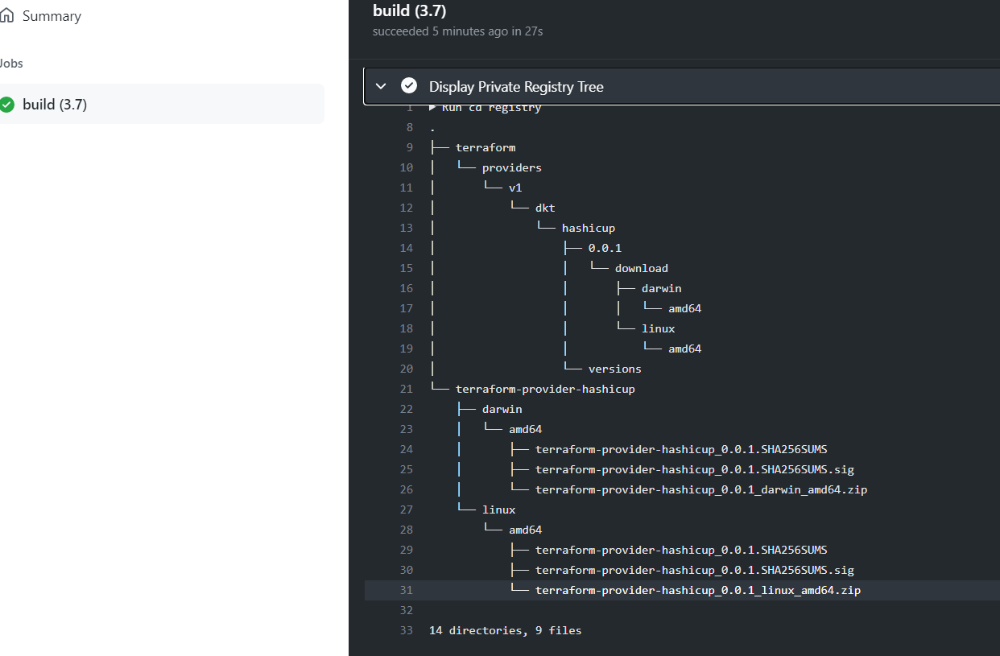

# Private Provider Registry Action v0.0.1


* `🚧 Warning ⚠️ This Github action is under developpement `
* `This is a beta release, it's up to you to make it evolve if you want to add your own code make merge request please`

# 👋 Welcome to private provider registry action !
Here you will a reimplementation of the Terraform Registry, intended to be used when your providers can't, shouldn't or don't need to be public.  
For all means and purposes it works in the same way as the public registry.
it's work only for terraform v13 and later.
also you can post links or Bugs 

## 📦 Packages/Libraries

* main.py create the registry tree structure

## 🔨 development 

create a virtualenv on your PC
* python3 -m venv venv
* source venv/bin/activate 
* pip install -r requierements.txt

Edit .env like that:
```
export go_os="linux,darwin"
export go_arch="amd64"
export gpg_public_key="-----BEGIN PGP PUBLIC KEY BLOCK-----\n\nmQGNBF/j4HABDADZx5w"
export gpg_keyid="FE2DAF04078851C75465D5DA73XXXXXXXXXXXXXX"
export server_name="ubuntu.localdomain"
export github_repo="myorg/terraform-provider-software,jbrunetext/terraform-provider-hashicup"
export github_token="XXXXXXXXXXXXXXXXXXXXXXXXXXXX"
export github_orga="myorg"
export github_max_release="2"
````

Note : gpg_public_key must be set with :
```cat public.pgp | sed -E ':a;N;$!ba;s/\r{0,1}\n/\\n/g'````

You can set server_name vars with you hostname server for your asset .You only need a apache or nginx with self signed certificate.

Next execute the main.py. It will generate the tree structure in /registry directory.

If main.py succeed download release from the previous step GoRelease. You will see you the arbo below:



next you just need to copy paste the directory registry in /var/www/html dir.
and finish with terraform13 init.


if you want to host your private providers on S3 ou Google storage you just need to implement python-package.yml github action.